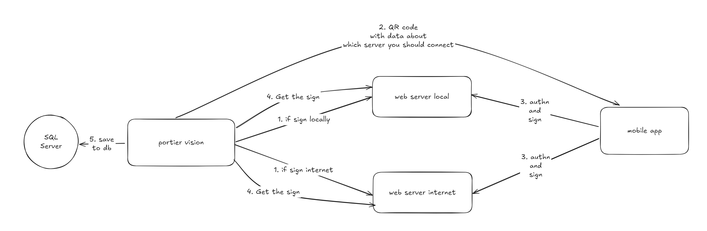

# portier KeyOnTheGo Services

## Flow



## Open API Spec

Open http://localhost:1233/ to view the docs. But if you need to generate QR Code for signing request, you need to run open the browser with your local IP address (e.g. http://192.168.1.12:1233, please check terminal for the IP address).

## Implementation

### Agent Header

Beside the request body and parameters, we also need to set `X-Portier-Agent` header to identify which app and version is making the request. The format should be `portier/<app name> (<OS Version>; <App Version>`.

Example:

```
portier/Vision (Windows 11; v5.0.1)
portier/KeyOnTheGo (Android 30; v1.0.0)
```

Here is an example implementation in [mobile app](https://github.com/portierglobal/keyonthego-app/blob/main/lib/utils.ts#L6-L12).

### Basic Auth

We use basic auth for authorization when using cloud server. Use Account Id and M2M token for username and password respectively. It's not implemented yet since we need to support M2M token for organization account in the future.

For local server, we don't need to set basic auth.
